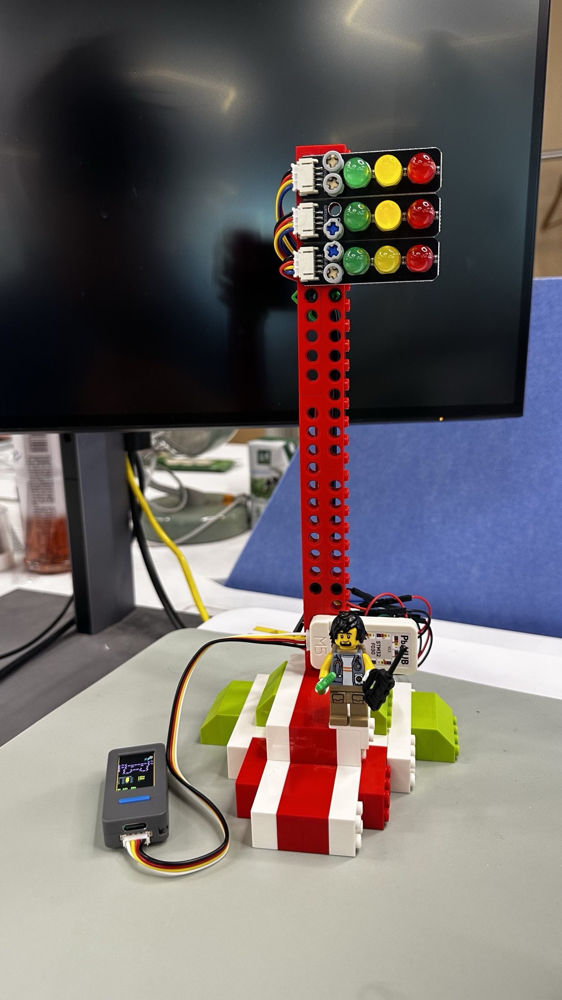

# 🚦 Claude Code Desk Buddy — your terminal, on a desk toy (now with real traffic lights)

Turn a pocket-size **M5Stack StickS3** into a live, glanceable dashboard for your
**Claude Code** sessions — and, optionally, a desktop **traffic-light tower** that
flips **🟢 green / 🟡 yellow / 🔴 red** so you know when Claude is working, idle, or
needs you **without looking at your screen**.

**No desktop app. No cloud.** Just your terminal + a tiny local Bluetooth bridge.

<p align="center">
  
</p>

---

## Why you'll want one

- **🚦 Ambient status across the room** — 🟢 = Claude's working, 🟡 = idle/standby,
  🔴 = it needs your input or approval. The traffic lights mirror up to **3 sessions
  at once**; the on-screen strip shows the same.
- **✅ Approve from the device** — when a tool needs permission the stick flashes red
  and beeps; tap **A** to approve, **B** to deny. No alt-tab, no hunting for the window.
- **🤖 Pure Claude Code — no desktop app** — driven straight from the CLI via hooks +
  a small local daemon. Runs headless, auto-reconnects.
- **🐾 A desk pet that lives off your approvals** — 18 ASCII species (or your own GIFs)
  that sleep when idle, get visibly impatient at a pending prompt, and celebrate level-ups.
- **🎮 Mini-games on the device** — a **reaction-time racer that uses the real traffic
  lights as F1 start lights**, plus slots, a tilt-ball maze, and a tilt-to-steer racer.
- **🔒 Privacy by design** — only counts, the coarse event type, and the project name
  ever leave your machine. No prompt text, file contents, diffs, or transcripts.
- **🔌 Open & hackable** — documented BLE protocol; build your own hardware against it.

---

## See it

<p align="center">
  
  
  
</p>

Left: a live `Bash` approval prompt — **A approves, B denies, right on the device.**
Middle: the pet's stats after a few approvals. Right: the hardware ID page.

---

## Quick start

1. **Flash the firmware + install the bridge & hooks** → **[docs/BUILD_NOTES.md](docs/BUILD_NOTES.md)**
   (the complete, no-desktop-app flow).
2. **(Optional) Build the traffic-light tower** — LEGO build, verified wiring, and
   firmware integration → **[docs/TRAFFIC_LIGHT.md](docs/TRAFFIC_LIGHT.md)**.
3. Open a `claude` session → the device lights up. Submit a prompt → **🟢 green**.
   A tool needs approval → it flashes **🔴 red**; press **A / B** to decide.

**Hardware:** [M5StickC Plus S3](https://shop.m5stack.com/) (ESP32-S3). Optional tower:
M5Stack **PbHub** + 3× **HS-F05-L** traffic-light modules (all LEGO-Technic mountable).

> **Building your own device?** You don't need this firmware. See **[REFERENCE.md](REFERENCE.md)**
> for the wire protocol: Nordic UART Service UUIDs, JSON schemas, and the folder push transport.

---

## How it works

```
claude CLI ──hooks──► buddy_hook.py ──unix socket──► buddy_bridge.py ──BLE──► StickS3 ──I2C──► PbHub ──► 🚦×3
```

Claude Code fires lightweight hooks on every session event; a tiny local daemon
(`bridge/buddy_bridge.py`) aggregates them and pushes session state to the stick over
Bluetooth every couple seconds, auto-reconnecting if the link drops. The firmware mirrors
that state to the screen and — if a PbHub + traffic lights are attached — to the physical
lights. See **[bridge/README.md](bridge/README.md)**.

---

## Controls

|                         | Normal               | Pet         | Info        | Approval    |
| ----------------------- | -------------------- | ----------- | ----------- | ----------- |
| **A** (front)           | next screen / game   | next screen | next screen | **approve** |
| **B** (right)           | scroll transcript    | next page   | next page   | **deny**    |
| **Hold A**              | menu                 | menu        | menu        | menu        |
| **Power** (left, short) | toggle screen off    |             |             |             |
| **Power** (left, ~6s)   | hard power off       |             |             |             |
| **Shake**               | dizzy                |             |             | —           |
| **Face-down**           | nap (energy refills) |             |             |             |

The screen auto-powers-off after 30s idle (kept on while an approval prompt is up);
any button press wakes it. An incoming approval/question pops to the front even mid-game.

## Mini-games

Menu → **GAMES**. **REACT** is an F1-style reaction timer that runs the build's physical
traffic lights as start lights (three reds build, lights-out + green = GO; press A as
fast as you can, best time saved). Plus **SLOTS** (skill-stop reels, swappable skins),
**MAZE** (tilt-ball), and **RACER** (tilt-to-steer dodge). **LIGHTS** runs a wiring
self-test that walks every lamp. Without the hardware, REACT plays fully on-screen.

## The pet's seven states

| State       | Trigger                     | Feel                        |
| ----------- | --------------------------- | --------------------------- |
| `sleep`     | bridge not connected        | eyes closed, slow breathing |
| `idle`      | connected, nothing urgent   | blinking, looking around    |
| `busy`      | sessions actively running   | sweating, working           |
| `attention` | approval pending            | alert, attention pulse      |
| `celebrate` | level up (every 50K tokens) | confetti, bouncing          |
| `dizzy`     | you shook the stick         | spiral eyes, wobbling       |
| `heart`     | approved in under 5s        | floating hearts             |

Eighteen ASCII species, each with these seven animations; Menu → "next pet" cycles them
(persists to NVS). Prefer a custom look? Drop a GIF character pack on the bridge — see
**GIF pets** below.

## GIF pets

A character pack is a folder with `manifest.json` + 96px-wide GIFs (one per state, or an
array that rotates). The whole folder must fit under 1.8MB; `tools/prep_character.py`
resizes a source set and `gifsicle --lossy=80 -O3 --colors 64` typically cuts 40–60%.
See `characters/bufo/` for a working example.

```json
{
  "name": "bufo",
  "colors": { "body": "#6B8E23", "bg": "#000000", "text": "#FFFFFF", "textDim": "#808080", "ink": "#000000" },
  "states": {
    "sleep": "sleep.gif",
    "idle": ["idle_0.gif", "idle_1.gif", "idle_2.gif"],
    "busy": "busy.gif", "attention": "attention.gif",
    "celebrate": "celebrate.gif", "dizzy": "dizzy.gif", "heart": "heart.gif"
  }
}
```

## Project layout

```
src/
  main.cpp        — loop, state machine, UI screens
  trafficlight.h  — PbHub traffic-light driver + session mirror
  game.h          — mini-game pack (REACT / SLOTS / MAZE / RACER)
  buddy.cpp       — ASCII species dispatch + render
  buddies/        — one file per species, seven anims each
  ble_bridge.cpp  — Nordic UART service, line-buffered TX/RX
  character.cpp   — GIF decode + render
  data.h          — wire protocol, JSON parse
bridge/           — CLI daemon + hooks + launchd agent (the no-desktop-app link)
docs/             — BUILD_NOTES, TRAFFIC_LIGHT (wiring + LEGO build)
bricks/           — Studio model (design.io), build plan (design.png), HS-F05-L part
characters/       — example GIF packs
tools/            — generators and converters
```

---

> **Unofficial fork.** Ports the upstream firmware from the original M5StickC Plus (ESP32)
> to the **M5StickC Plus S3** (ESP32-S3), adds the **Claude Code CLI bridge** (no desktop
> app) and the **PbHub traffic-light** integration. Upstream doesn't accept board-port PRs —
> see [CONTRIBUTING.md](CONTRIBUTING.md). Protocol reference and original board support:
> [anthropics/claude-desktop-buddy](https://github.com/anthropics/claude-desktop-buddy).
> The BLE API on the official desktop apps is a maker/developer feature (enable Developer
> Mode), not an officially supported product feature.
