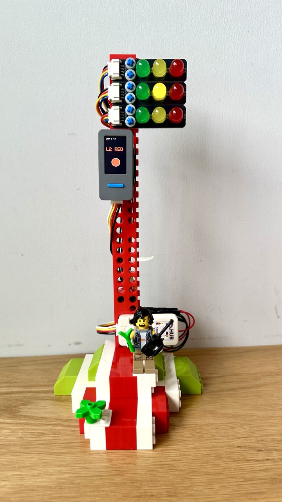
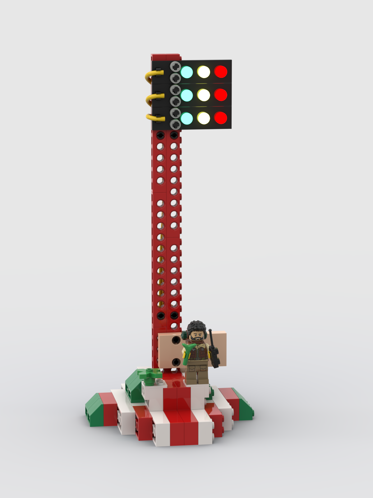
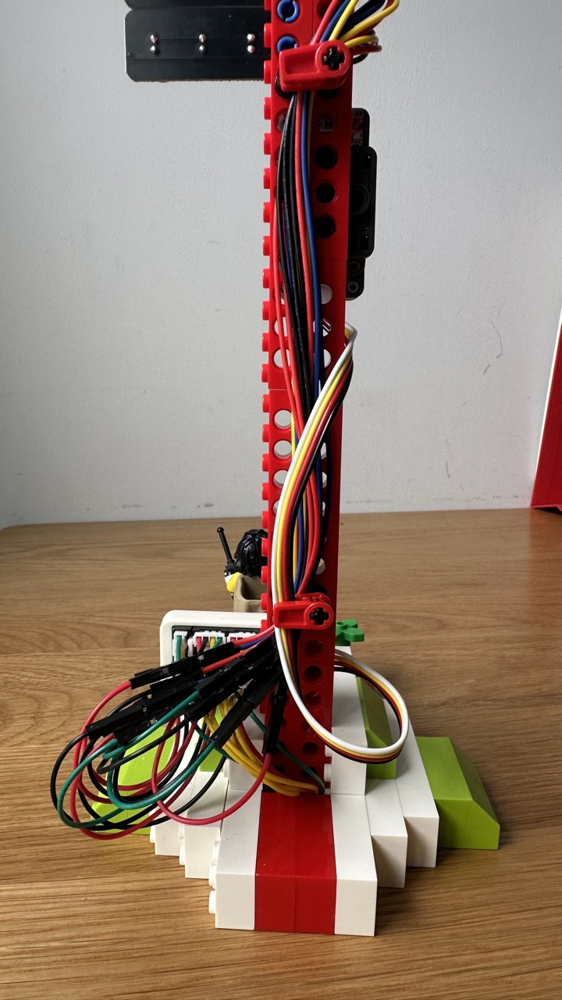

# 实体交通灯外设 — 完整文档（积木 + 接线 + 固件）

StickS3 经 PbHub 驱动 3 个 HS-F05-L 交通灯模块，做成屏幕"会话条"的外置版，并被
REACT 反应竞速游戏复用为发车灯。本文件汇总**经硬件自检验证过**的：乐高搭建方案、
接线/寄存器、固件映射、安全事项，供复现与排障。

相关代码：`src/trafficlight.h`、`src/game.h`（REACT）、`src/main.cpp`。
相关文件：`bricks/design.io`（Studio 模型）、`bricks/design.png`（搭建图）、
`bricks/HS-F05-L.part`（交通灯模块的自定义件）。

---

## 0. 成品效果



会话状态实时映射到 3 个交通灯：运行=绿 / 空闲=黄 / 等输入·等批准=红。

---

## 1. 拓扑

```
StickS3 (M5StickS3)
   │  Grove A 口 / HY2.0-4P，I2C 主机（防呆，直插）
   ▼
PbHub v1.1 (I2C 从机, 地址 0x61)
   │  6 个 Port.B 通道 CH0~CH5，每通道 2 路数字 IO（IO0 / IO1）
   ▼
交通灯 ×3（HS-F05-L，排针顺序 GND / GR / YE / RE，共阴，拉高点亮）
```

- 9 路信号（3 灯 × 红黄绿）分布在 **5 个通道**上，**避开 CH3**（CH2/CH3 插线困难，
  把插头削薄插到 CH1）。
- 每通道用满 2 路数字输出（IO0 + IO1），5 通道 = 10 路，占 9 路，**CH5·IO1 空、CH3 空**。

---

## 2. 物料（BOM）

| 配件 | 数量 | 用途 |
|---|---|---|
| M5StickS3 | 1 | 主机（ESP32-S3） |
| M5Stack Clip B | 1 | 桌面支架/夹持，固定主机到积木上 |
| Unit PbHub v1.1 | 1 | I2C 扩展，驱动交通灯 |
| Grove 线（HY2.0-4P） | 1 | StickS3 ↔ PbHub，PbHub自带 |
| HS-F05-L 交通灯 LED 模块 | 3 | 红/黄/绿三色灯，来自hellostem，选乐高插孔款 |
| PH2.0-4P - 杜邦（母）线 | 3 | HS-F05-L，买交通灯带线款 |
| Grove（HY2.0-4P）- 杜邦(公)线 | 3 | PbHub 通道 ↔ 交通灯排针，随便买 |
| 乐高 Technic 件 | 若干 | 旗杆/底座（清单见 §3 与 `bricks/`） |

> 详细规格见 [§2 物料（BOM）](#2-物料bom)；搭建用乐高件见 §3。

## 3. 乐高搭建方案

完整模型见 **`bricks/design.io`**（用 BrickLink Studio 打开）。搭建图：



结构（自下而上）：
- **底座**：白/红/浅绿砖体 + 乐高小人（乐高乐园限定摄影师人仔），PbHub 固定在底座上。
- **旗杆（桅杆）**：两根**并排竖立的红色 Technic 带孔梁**——
  - 右轨 = `3703`(1×16) ×2；左轨 = `3702`(1×8) + `3895`(1×12) ×2，接缝错开更结实；
  - 竖立梁宽 24 LDU，两轨**贴合**（中心相距 24 LDU = 9.6mm；同梁相邻孔为 8mm）。
- **顶部固定交通灯**：右轨顶部 6 孔插 **`43093`（Axle 1L + 摩擦销）**，销端入孔、
  十字端套 **`3713` 衬套**，把交通灯面板压在旗杆前面。
- **背面理线**：从顶向下数第 7 孔，**背面**插 **`18651`（Axle 2L + 摩擦销）** + 衬套，
  配 **`49283`（Technic Axle & Wire Connector / 理线夹）**夹住线束。
- **交通灯模块**：3 块 HS-F05-L 上下叠（每块横排 绿-黄-红），用十字轴穿过模块的
  Ø4.7mm 孔 + 旗杆梁的 Technic 孔固定。

> 提示：HS-F05-L 的孔距 = 标准乐高 Technic 孔距（8mm，Ø4.8mm），所以电子模块能直接
> 用乐高十字轴/销固定到带孔梁上，无需额外支架。


背面线材较多。Grove线刚好可以塞入乐高科技的理线夹。背面设计了线材收纳结构，可以收纳其他线材。HY2.0有7根多余的线，可以电胶布绝缘后塞到底部，经过带孔梁的孔放进底部的空间。



---

## 4. 接线一：StickS3 ↔ PbHub（I2C）

一根标准 Grove 线直插，防呆，不会接错。

| 线色 | 信号 |
|---|---|
| 黑 | GND |
| 红 | 5V |
| 黄 | SDA |
| 白 | SCL |

- 固件用 M5Unified 的外部 I2C `M5.Ex_I2C`（自动取 Grove 口 GPIO，**勿硬编 32/33**）。
- PbHub 地址 **0x61**（可经 A0~A2 焊点改 0x61~0x68）。

---

## 5. 接线二：PbHub 通道 ↔ 3 个交通灯（**权威表**）

下表是**最终验证过**的映射（以 PbHub 通道 + IO 索引为准 —— 这是固件 `TL_LAMP`
的真实对应，不受"黄/白线哪根是 IO0"的标注歧义影响）。照此连线即可直接工作。

| 交通灯 | RE（红） | YE（黄） | GR（绿） |
|---|---|---|---|
| **灯1**（模块0） | CH0 · IO1 | CH0 · IO0 | CH1 · IO1 |
| **灯2**（模块1） | CH1 · IO0 | CH2 · IO1 | CH2 · IO0 |
| **灯3**（模块2） | CH4 · IO1 | CH4 · IO0 | CH5 · IO1 |

- **GND**：3 个模块的 GND 全部并接，接任一已用通道的 GND（黑线）即可，共地。
- **5V（红线）全部不接**：模块只用 GND + 3 路信号，信号由 IO 脚 3.3V 经限流点亮。
- **CH3 整条空闲；CH5·IO0 空闲。**

> 备注：本机布线时，每个通道的两根信号线相对"IO0=黄线/IO1=白线"的惯例是**对调**
> 接的（自检发现每通道一致地反），所以上表看起来"红走 IO1、黄走 IO0"。重新布线时
> **以本表的"通道·IO 索引"为准**，无论实际用哪根线插。

固件侧映射（`src/trafficlight.h`，逻辑灯 0..8 = 灯1R/Y/G、灯2R/Y/G、灯3R/Y/G）：

```c
static const TLPin TL_LAMP[9] = {
  {0, 1}, {0, 0}, {1, 1},   // 灯1 R Y G
  {1, 0}, {2, 1}, {2, 0},   // 灯2 R Y G
  {4, 1}, {4, 0}, {5, 1},   // 灯3 R Y G   (CH3 避开)
};
```

---

## 6. PbHub I2C 寄存器（自行驱动时参考）

驱动单路 = 一次寄存器写：`writeRegister8(0x61, reg, 0|1)`（0 灭 / 1 亮）。

```
reg = (0x40 + 0x10 * chTable[ch]) + io     // chTable = {0,1,2,3,4,6}
```

| 通道 | 基址 | IO0 | IO1 |
|---|---|---|---|
| CH0 | 0x40 | 0x40 | 0x41 |
| CH1 | 0x50 | 0x50 | 0x51 |
| CH2 | 0x60 | 0x60 | 0x61 |
| CH3 | 0x70 | 0x70 | 0x71 |
| CH4 | 0x80 | 0x80 | 0x81 |
| CH5 | 0xA0 | 0xA0 | 0xA1 |

> 注意 CH5 基址是 **0xA0**（chTable[5]=6，不是 0x90）。寄存器字节与设备地址 0x61
> 数值相同纯属巧合（0x61 是寄存器，不是 I2C 地址），无冲突。
> 来源：核对 `m5stack/M5Unit-HUB` 的 `unit_PbHub.cpp`（`writeDigital0/1`）。

---

## 7. 固件集成

- **状态镜像**（`tlUpdate`）：把 `TamaState.sessState[0..2]` 映射到 3 个模块——
  `运行=绿(常亮) / 空闲=黄(常亮，每分钟心跳闪一次) / 等输入·等批准=红(低频闪) / 无会话=灭`
  （perm 几乎不出现，等输入+等批准合并为红）。**切换瞬间**新颜色快闪 ~4 次强调；
  **稳态只有红色低频闪**，绿常亮、黄常亮带 1/min 心跳。仅在亮灭翻转时写 I2C。
  屏幕首页会话条配色与此一致（绿·黄·红，见 `drawSessionStrip`）。
- **会话→模块的分配**：bridge 固定槽位 + 活跃度驱逐——会话占住一个槽不乱跳，更活跃的
  会话进来才挤掉最不活跃的（始终展示最活跃的 3 个）。
- **红的判定**：只有**明确的等待**才红——PermissionRequest / AskUserQuestion / 或
  最后一条消息以问号结尾（hook 启发式，只发布尔不发正文）。单纯 idle_prompt 超时算黄。
- **自检**：菜单 `GAMES` 旁的 **`lights`** 项 → `tlSelfTest()`：先探测 0x61 并显示
  SDA/SCL，再逐颗点亮 9 路（屏幕同步显示 `L1 RED…L3 GRN`）验线。
- **REACT 游戏**：复用 3 个模块当发车灯（红逐个亮 → 熄红亮绿=GO）。游戏期间 `tlUpdate`
  让位（`if (!gameActive) tlUpdate(tama)`），退出后 `tlResync()` 让镜像重绘。
- **无 PbHub 时**：`tlBegin()` 探测失败 → 全程 no-op，屏幕功能不受影响。

---

## 8. 防烧器件检查表

1. 交通灯模块若**无板载限流电阻**，每路串 **220~330Ω**（3.3V 驱动）；不确定先加 330Ω。
2. PbHub 输出脚是 STM32 推挽口，单脚电流压在 **≤10mA**（330Ω@3.3V≈4mA，安全）。
3. **必须共地**：模块 GND 接到 PbHub 通道 GND。
4. **别把信号线插到红线（5V）**：本接法 5V 完全不用，误接 5V 到模块信号脚会烧模块。
5. StickS3↔PbHub 是防呆 Grove，放心；**勿用杜邦线手工对接绕过防呆**，以免 5V 错位。
6. 共阴模块**拉高点亮**；若整体反相（该亮不亮），说明是共阳，把固件 `tlSet` 的 0/1 对调。

---

## 9. 运维（刷机 + bridge）

- 刷机：`source ~/.pio-venv/bin/activate && pio run -e m5stick-s3 -t upload`。
- StickS3 无 GPIO-0；若自动复位失败、串口消失，**插 USB 长按侧面电源键 3~5s 至绿灯闪**进下载模式。
- bridge（`bridge/buddy_bridge.py`）的 BLE 重连：掉线**在进程内退避重连**（快速掉线
  2/4/8…s 退避，避免疯狂重启），只有**长时间扫不到设备**才换新进程（清 CoreBluetooth）。
- 若"连上即掉"反复出现：**把 s3stick 关机再开**（重置设备 BLE）最有效。
- 手动重连：`launchctl kickstart -k gui/$(id -u)/com.claude-buddy.bridge`。
